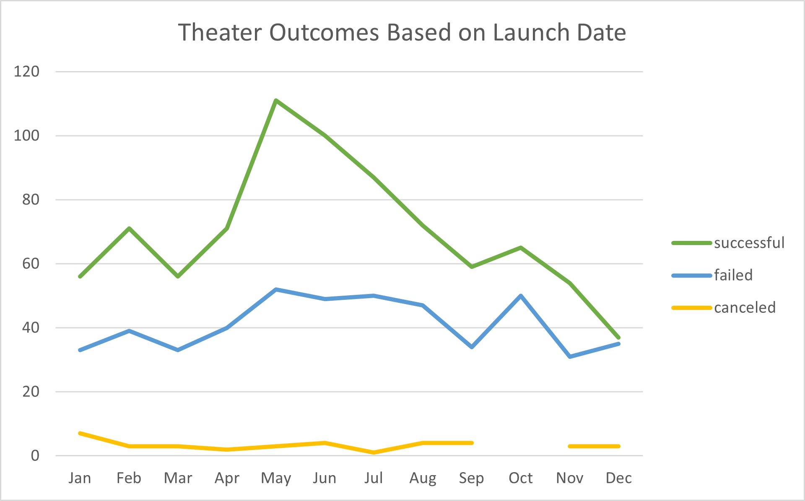

# Kickstarter analysis

The Kickstater data set is analyzed with Excel to find out how different campaigns fared in relation to their launch dates and their funding goals.  

### Deliverable 1
The theather campain outcomes are displayed in a line chart

### Deliverable 2
In this deliverable a line chart titled "Outcomes Based on Goal" is created to visualize the relationship between the goal-amount ranges on the x-axis and the percentage of successful, failed, or canceled projects on the y-axis.

